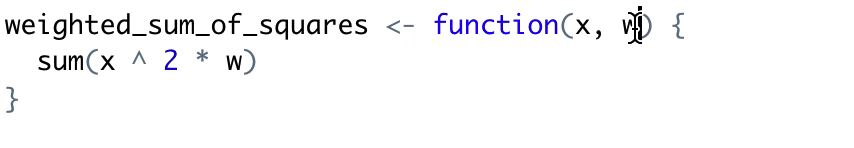

# Refactorings

## Composing Methods

Much of refactoring is devoted to correctly composing methods. In most cases, excessively long methods are the root of all evil. The vagaries of code inside these methods conceal the execution logic and make the method extremely hard to understand – and even harder to change.

The refactoring techniques in this group streamline methods, remove code duplication, and pave the way for future improvements.

### Extract Function

used

### Inline Function

used

### Extract Variable

### Inline Temp

### Replace Temp with Function

used

### Split Temporary Variable

### Remove Assignments to Parameters

### Replace Method with Method Object

### Substitute Algorithm

## Moving Features between Objects

Even if you have distributed functionality among different classes in a less-than-perfect way, there is still hope.

These refactoring techniques show how to safely move functionality between classes, create new classes, and hide implementation details from public access.

### Move Method

### Move Field

### Extract Class

Used

### Inline Class

Used

### Hide Delegate

### Remove Middle Man

### Introduce Foreign Method

### Introduce Local Extension

## Organizing Data

These refactoring techniques help with data handling, replacing primitives with rich class functionality. Another important result is untangling of class associations, which makes classes more portable and reusable.

### Change Value to Reference

### Change Reference to Value
### Duplicate Observed Data

### Self Encapsulate Field

### Replace Data Value with Object

### Replace Array with Object

### Change Unidirectional Association to Bidirectional

### Change Bidirectional Association to Unidirectional

### Encapsulate Field

### Encapsulate Collection

### Replace Magic Number with Symbolic Constant

### Replace Type Code with Class

### Replace Type Code with Subclasses

### Replace Type Code with State/Strategy

### Replace Subclass with Fields

### Replace Atomic with S3 Class

## Simplifying Conditional Expressions

used

Conditionals tend to get more and more complicated in their logic over time, and there are yet more techniques to combat this as well.

### Consolidate Conditional Expression

### Consolidate Duplicate Conditional Fragments

### Decompose Conditional

### Replace Conditional with Polymorphism

### Remove Control Flag

used

### Replace Nested Conditional with Guard Clauses

### Introduce Null Object

### Introduce Assertion

## Simplifying Method Calls

These techniques make method calls simpler and easier to understand. This, in turn, simplifies the interfaces for interaction between classes.

### Add Parameter

### Remove Parameter

### Rename Method

### Separate Query from Modifier

### Parameterize Method

### Introduce Parameter Object

used

### Preserve Whole Object

used

### Remove Setting Method

### Replace Parameter with Explicit Methods

### Replace Parameter with Method Call

### Replace Parameter with Query

used

Before:

```{r, class.source="before"}
simple_mean <- function(x, length) {
  sum(x) / length
}
```

After:

```{r, class.source="after"}
simple_mean <- function(x) {
  length <- length(x)
  sum(x) / length
}
```

### Hide Method

### Replace Constructor with Factory Method

### Replace Error Code with Exception

### Replace Exception with Test

## Dealing with Generalization

Abstraction has its own group of refactoring techniques, primarily associated with moving functionality along the class inheritance hierarchy, creating new classes and interfaces, and replacing inheritance with delegation and vice versa.

### Pull Up Field

### Pull Up Method

### Pull Up Constructor Body

### Push Down Field

### Push Down Method

### Extract Subclass

### Extract Superclass

### Extract Interface

### Collapse Hierarchy

### Form Template Method

### Replace Inheritance with Delegation

### Replace Delegation with Inheritance

## Other

### Remove Dead Code

used

### Change Function Declaration

Used

### Replace Loop With Apply

Used

### Rename Function

See also: [rename variable](#rename-variable)

Before:

```{r, class.source="before"}
ss <- function(x) {
  sum(x ^ 2)
}
```

After:

```{r, class.source="after"}
sum_of_squares <- function(x) {
  sum(x ^ 2)
}
```

"Find in files..." command
 
### Rename Argument

See also: [rename function](#rename-function)

Having informative variable names in your is important for your readability. 
One of the main culprits are single letter variable such as `w` when the fully spelled out word `weight` isn't that much longer.
This becomes increasingly important once you have many variables and you come back after a break not remembering what `pisg` means.

Before:

```{r, class.source="before"}
weighted_sum_of_squares <- function(x, w) {
  sum(x ^ 2 * w)
}
```

After:

```{r, class.source="after"}
weighted_sum_of_squares <- function(x, weight) {
  sum(x ^ 2 * weight)
}
```

Renaming a variable inside a function can be easily done in RStudio using the "Rename in Scope" shortcut
`Ctrl/Cmd + Shift + Alt/Option + M`.



### Rename Variable

used


